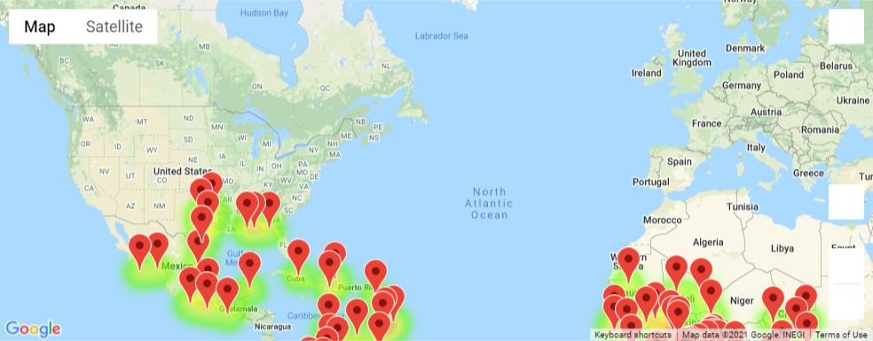
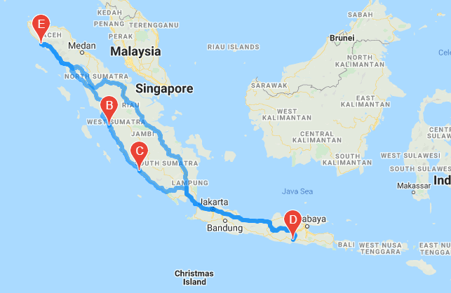
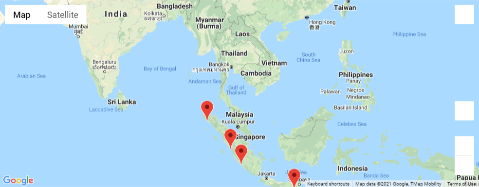

# World Weather Analysis

## Overview
For this project we analyzed different weather patterns around the globe. This offers insights to travelers looking to book a vacation. 
We have broken the analysis down into three parts: weather database, vacation search, and vacation itinerary.

### Weather Database
This folder uses Open Weather Map API to pull useful weather information on different cities around the world. 
1. Maximum Temperature
2. Cloudiness
3. Wind Speed
4. Humidity
5. Current Weather Description

These different categories of information make it easy for travelers to find exactly what they are looking for in a travel destination.

### Vacation Search
This folder uses the information gained from the weather database and uses Google Maps API to plot different travel destinations with a hotel options. The image below shows the locations of all the places in the database that have an daily maximum temperature between 75 and 90 degrees farinheit.

### Vacation Itinerary
This folder takes the search information from the search folder and uses Google Maps directions API to create a vacation itinerary. For example, the image below shows a 4 stop itinerary in Singapore. 

Hotels for each location.

### Additional Information
Additionally, there is a resources folder that displays linear regression models looking at the correlation between different weather infromation and latitude. 
